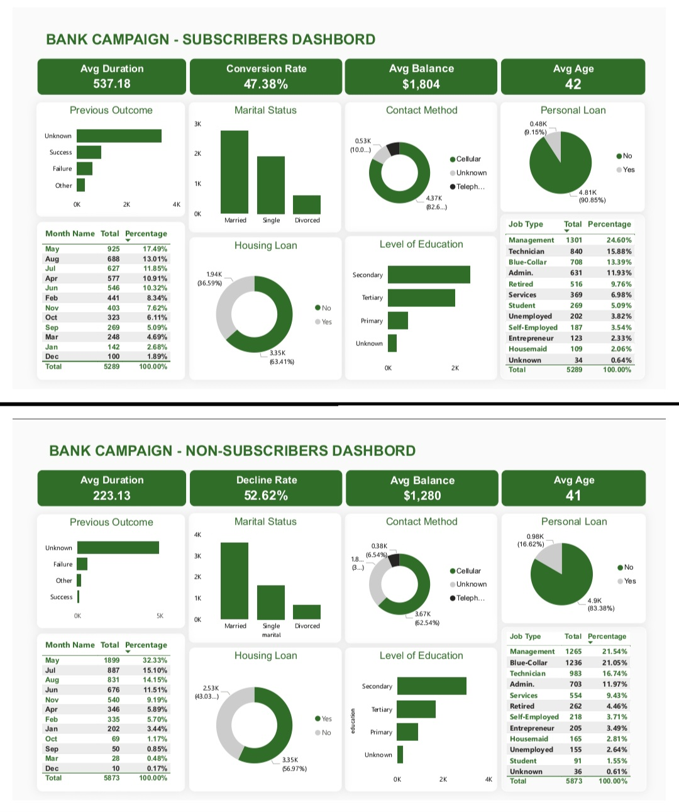

# Bank Term Deposit Campaign Analysis

**A data-driven investigation into why customers subscribe to term deposits and how a bank can improve future campaign targeting.**

---

## Table of Contents

- [Overview](#overview)
- [Business Questions](#business-questions)
- [Dataset](#dataset)
- [Key Metrics](#key-metrics)
- [Key Visualizations](#key-visualizations)
- [Major Findings](#major-findings)
- [Recommendations](#recommendations)
- [Conclusion](#conclusion)
- [Repository Structure](#repository-structure)
- [Tools Used](#tools-used)

---

## Overview

This project analyzes a bank's term-deposit marketing campaign, covering **11,162 client contacts**, to understand what separates customers who subscribed from those who declined. The goal was not to build a dashboard for its own sake, but to answer two concrete business questions and translate the answers into actionable recommendations.

## Business Questions

1. **Why do some customers subscribe to term deposits while others do not?**
2. **Which customer groups are more likely to respond positively to marketing campaigns?**

## Dataset

The dataset is split into two views: **Subscribers** and **Non-Subscribers**, each capturing:

- Call duration and contact channel (cellular / telephone / unknown)
- Demographics: age, job category, marital status, education level
- Financial indicators: average balance, housing loan status, personal loan status
- Campaign history: previous campaign outcome, month of contact

## Key Metrics

| Metric | Subscribers | Non-Subscribers |
|---|---|---|
| Total Contacts | 5,289 (47.38%) | 5,873 (52.62%) |
| Avg. Call Duration | 537.18s | 223.13s |
| Avg. Balance | $1,804 | $1,280 |
| Avg. Age | 42 | 41 |
| No Housing Loan | 63.41% | 43.03% |
| No Personal Loan | 90.85% | 83.38% |

## Key Visualizations

The full slide deck ([`presentation/Bank_Campaign_Analysis.pptx`](Bank_Campaign_Analysis.pptx)) includes:

- Headline metric comparisons (duration, conversion/decline rate, balance, age)
- Occupation mix by subscription status
- Contact channel breakdown (cellular vs. telephone vs. unknown)
- Housing loan status comparison

The source dashboard is available at [`dashboard/bank-campaign-dashboard.jpg`](Bank-campaign-dashboard.jpg).

## Major Findings

1. **Call duration is the strongest signal.** Subscribers averaged 537 seconds per call vs. 223 seconds for non-subscribers, a 2.4x gap. Meaningful conversations, not just call volume, drove conversions.
2. **Debt load matters.** 63% of subscribers had no housing loan compared to 43% of non-subscribers, and 91% had no personal loan compared to 83% of non-subscribers. Customers with fewer financial obligations had more room to commit to a new deposit.
3. **Previous campaign outcome is revealing, but incomplete.** "Unknown" was the largest category for both groups, likely a mix of genuinely new customers with no campaign history and records that were never properly logged. Among customers with a known outcome, subscribers skewed heavily toward past success, while non-subscribers skewed toward past failure.
4. **Occupation shapes conversion likelihood.** Management professionals formed the largest subscriber group. Blue-collar workers made up 21.05% of non-subscribers but only 13.39% of subscribers, the largest gap of any occupation.
5. **Demographics and channel matter.** Married customers and those with secondary education represented the largest subscriber groups. Cellular contact was the most effective channel, reaching 82.6% of subscribers vs. 62.5% of non-subscribers.
6. **May is the seasonal peak.** Both groups saw their highest contact volume in May, though non-subscriber volume was more concentrated in a handful of months.

See [`Analysis_Report`](Bank_Marketing_Campaign_Analysis_Report.pdf) for the full breakdown.

## Recommendations

- **Segment customers** before launching campaigns instead of using one strategy for everyone.
- **Tailor messaging for blue-collar customers** to improve engagement, since they are the most under-converted segment.
- **Focus on call quality, not just call volume** — coach agents toward longer, more meaningful conversations.
- **Re-target customers with a successful prior campaign outcome**, the strongest repeat-conversion signal in the data.
- **Properly record "unknown" outcomes going forward**, so future analysis isn't left guessing between new customers and missing data.
- **Plan staffing around seasonal peaks**, since contact volume consistently spikes in May.

## Conclusion

Conversion in this campaign wasn't random. It was driven by a combination of financial profile, occupation, demographics, and the quality of engagement during the call itself. Moving from a one-size-fits-all campaign to a segmented, data-informed approach gives the bank a clear path to lifting its conversion rate above the current 47.38% baseline.

## Tools Used

Power BI · Excel 

---

*Analysis Report by Awe Daniel*
